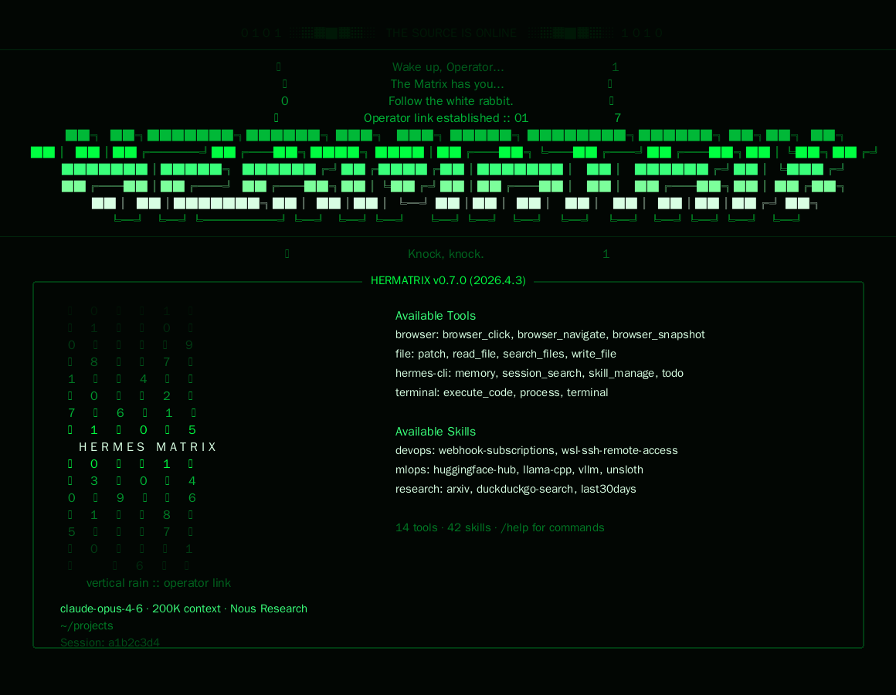

# HERMATRIX Skin for Hermes Agent

Premium Matrix-inspired skin for Hermes Agent — deep black cyberpunk aesthetics, cinematic green rain, operator-style boot text, and a bold **HERMATRIX** identity.



## Current version

**v1.0.0** — first formal versioned release, with native Windows PowerShell install support and fixed Windows Hermes skin paths.

- Release notes: [CHANGELOG.md](CHANGELOG.md)
- GitHub releases: <https://github.com/lipebez/hermes-matrix-skin/releases>

## Features

- **Cinematic banner** — ASCII art HERMATRIX with iconic Matrix dialogue (`Wake up, Operator...`)
- **Digital rain hero** — vertical katakana/number rain (`ﾊ ﾒ 0 ﾄ ｶ ﾂ ﾗ ﾅ`) with decorative accents throughout the banner
- **Binary spinner** — animated faces: `0`, `1`, `01`, `10`, `▓`, `▒`, `░`
- **14 thinking verbs** — random Matrix-themed messages while the agent thinks:
  `following the white rabbit` · `dodging bullets` · `consulting the oracle` · `jacking in` · `choosing the red pill` · `defying gravity` · `seeing through the code` · and more
- **Custom prompt** — `ﾎ> ` with `⣿ OPERATOR` response label
- **Deep green palette** — full gradient from `#001806` to `#D8FFE3` on pure black
- **Personalize** — replace "Operator" with your name via one command

## Install

### macOS / Linux / WSL / Git Bash

```bash
curl -fsSL https://raw.githubusercontent.com/lipebez/hermes-matrix-skin/main/install.sh | bash
```

### Windows PowerShell

Use the PowerShell installer instead of `curl ... | bash`:

```powershell
irm https://raw.githubusercontent.com/lipebez/hermes-matrix-skin/main/install.ps1 | iex
```

Then open Hermes and use:

```text
/skin matrix
```

## Why PowerShell has a separate command

On Windows, Hermes stores user data in `%LOCALAPPDATA%\hermes` by default. The Bash installer also supports Git Bash/MSYS/Cygwin, but PowerShell users should use `install.ps1` so the skin lands in the same Hermes home that the local Windows Hermes app reads.

If you use a custom Hermes home, set `HERMES_HOME` before installing.

## Personalize

Replace **"Operator"** with your name or nickname.

### macOS / Linux / WSL / Git Bash

```bash
curl -fsSL https://raw.githubusercontent.com/lipebez/hermes-matrix-skin/main/customize.sh | bash
```

Or pass your name directly:

```bash
curl -fsSL https://raw.githubusercontent.com/lipebez/hermes-matrix-skin/main/customize.sh | bash -s "Neo"
```

### Windows PowerShell

```powershell
irm https://raw.githubusercontent.com/lipebez/hermes-matrix-skin/main/customize.ps1 | iex
```

Or pass your name directly:

```powershell
& ([scriptblock]::Create((irm https://raw.githubusercontent.com/lipebez/hermes-matrix-skin/main/customize.ps1))) -Name "Neo"
```

This updates the banner greeting (`Wake up, Neo...`) and the response label (`⣿ NEO`). A backup of the original file is created automatically.

## Manual install

### macOS / Linux / WSL

```bash
mkdir -p ~/.hermes/skins
curl -fsSL https://raw.githubusercontent.com/lipebez/hermes-matrix-skin/main/skins/matrix.yaml \
  -o ~/.hermes/skins/matrix.yaml
```

### Windows PowerShell

```powershell
New-Item -ItemType Directory -Force "$env:LOCALAPPDATA\hermes\skins"
irm https://raw.githubusercontent.com/lipebez/hermes-matrix-skin/main/skins/matrix.yaml `
  -OutFile "$env:LOCALAPPDATA\hermes\skins\matrix.yaml"
```

Then use:

```text
/skin matrix
```

## Files

```text
skins/matrix.yaml          # HERMATRIX theme
screenshots/matrix.png     # Preview image
install.sh                 # Bash installer
install.ps1                # PowerShell installer
customize.sh               # Bash personalizer
customize.ps1              # PowerShell personalizer
```

## Notes

- Technical skin name: `matrix`
- Visual identity: `HERMATRIX`
- Public wake-up line: `Wake up, Operator...`
- Versioning: public releases use semantic version tags such as `v1.0.0`.

## License

MIT
